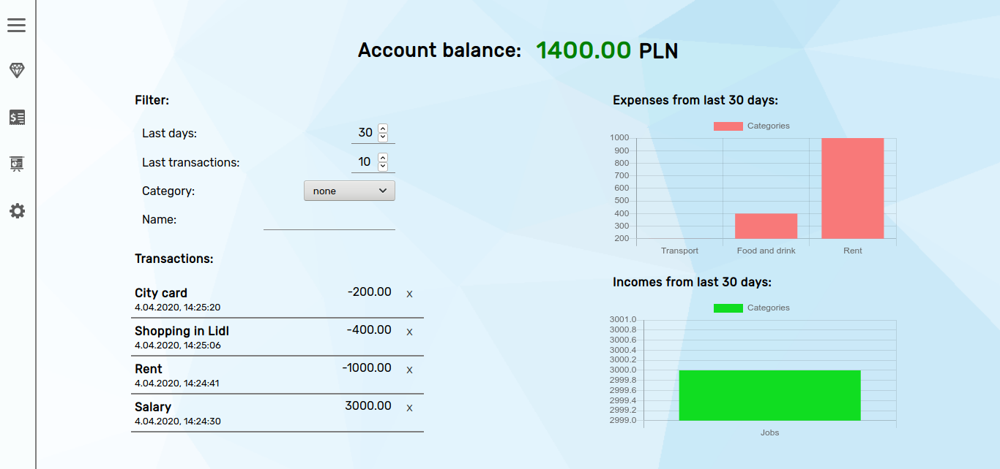

# Expense tracker built with Vue.js

Welcome to my simple expense tracker app built with Vue.js.

## Features
* Full responsiveness
* Adding and deleting incomes and outcomes
* Exporting data to JSON format
* Importing data from JSON file (it has to match the format mentioned at the end of readme)
* Advanced entries filtering and searching
* Gathering the data using Local Storage
* Display of collected data in form of convinient charts

## Technology stack
* HTML 5
* CSS and SCSS
* JavaScript
* Vue & Vue Router
* Vue CLI
* vuechart-js

## Design overview

 

## Link
https://bordowyrydwan.github.io/expense-tracker

## Exported data format
```javascript
[
    {
        id: Number, 
        type: String, //category of income, e.g. "Work"
        desc: String, //description of income, e.g. "Rent"
        amount: Number,
        date: String,
        time: String
    }
]
```


